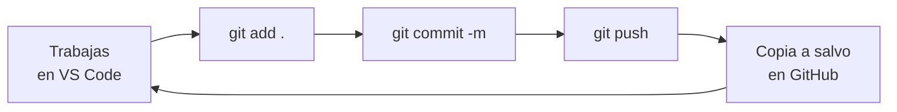

# Arrancar un proyecto en VS Code sin saber programar

Guía de instalación y primeros pasos para quien no ha tocado nunca un editor de
código. Al terminar tendrás un proyecto funcionando en tu ordenador, con
historial de cambios, copia de seguridad en internet y un asistente de IA
trabajando dentro del editor.

Está escrita para **Windows**. Calcula entre 45 y 60 minutos la primera vez.

No hace falta saber programar. Hace falta saber copiar, pegar y leer lo que
aparece en pantalla.

---

## 1. Las cinco piezas

Los nombres se parecen y ahí empieza la confusión. Son cinco cosas distintas:

| Pieza | Qué es | Dónde vive |
| --- | --- | --- |
| La carpeta del proyecto | Una carpeta normal de tu ordenador | Tu disco duro |
| VS Code | El editor: la ventana donde trabajas | Tu ordenador |
| Git | El programa que guarda el historial de esa carpeta | Tu ordenador, sin ventana propia |
| GitHub | La web donde vive la copia de ese historial | Internet |
| Claude Code | El asistente que lee y escribe archivos por ti | Dentro de VS Code |

**La confusión más habitual es entre Git y GitHub.** Git es el programa que
guarda fotos de tu carpeta y funciona sin conexión a internet. GitHub es el
sitio web donde subes esas fotos para tener respaldo y poder compartirlas.
Puedes usar Git sin GitHub, pero entonces no tienes copia de seguridad.

---

## 2. Comprobar qué tienes e instalar lo que falte

Antes de instalar nada, comprueba. Es posible que ya tengas alguna pieza.

Abre VS Code, y dentro de él abre el terminal: menú **Terminal**, opción
**Nuevo terminal**. Escribe estas dos líneas, una cada vez, pulsando Intro:

```
git --version
node --version
```

Si te responde algo como `git version 2.55.0`, ya lo tienes. Si te dice que no
reconoce el comando, te falta.

**VS Code.** Si aún no lo tienes, descárgalo de `code.visualstudio.com`.

**Git para Windows.** Descárgalo de `git-scm.com` y ejecuta el instalador. Son
muchas pantallas de opciones, y la respuesta correcta en todas es dejar lo que
viene marcado y pulsar siguiente. Al terminar, **cierra VS Code por completo y
vuelve a abrirlo**, porque si no el terminal seguirá sin encontrarlo.

**Node.** Descárgalo de `nodejs.org` eligiendo la versión **LTS**. Lo necesita
el asistente de IA.

**Cuenta de GitHub.** Créala en `github.com` si no la tienes. Usa un correo al
que vayas a seguir teniendo acceso dentro de dos años y activa la verificación
en dos pasos cuando te la ofrezca.

**Claude Code.** En VS Code, abre el panel de extensiones (el icono de los
cuatro cuadrados, o `Ctrl` + `Mayús` + `X`), busca `Claude Code` e instala el
que publica **Anthropic**. Fíjate en el nombre del editor bajo el título,
porque suelen aparecer extensiones parecidas de terceros.

> Las herramientas de IA cambian de forma de instalarse cada pocos meses. Si lo
> que ves en pantalla no coincide con esto, haz caso a la pantalla.

---

## 3. El mapa de VS Code

VS Code tiene muchas zonas. Para empezar solo necesitas cuatro:

| Zona | Dónde está | Para qué la usas | Cómo se abre |
| --- | --- | --- | --- |
| Barra de iconos | Borde izquierdo | Cambiar entre paneles | Siempre visible |
| Explorador | Panel izquierdo | Ver y abrir los archivos del proyecto | Primer icono, dos hojas |
| Editor | Centro | Escribir y leer archivos | Al abrir cualquier archivo |
| Terminal | Franja inferior | Escribir órdenes de Git | Menú Terminal, Nuevo terminal |

El tercer icono de la barra, tres puntos unidos por líneas, es el **control de
código fuente**: la cara visible de Git dentro del editor. Ahí verás la lista de
archivos que has cambiado desde la última vez que guardaste.

La pieza que probablemente no hayas usado nunca es el **terminal**, y es la que
más vas a necesitar, porque Git se maneja escribiendo órdenes. No tiene
misterio: escribes una línea, pulsas Intro y te responde. Si te equivocas al
teclear, te dirá que no reconoce el comando y no pasa nada más.

Guarda este atajo: `Ctrl` + `Mayús` + `P` abre la **paleta de comandos**, un
buscador de todo lo que VS Code sabe hacer. Si no encuentras una opción en los
menús, escríbela ahí.

> Según cómo lo tengas instalado, los menús pueden aparecer en inglés:
> *Terminal, New Terminal* en lugar de *Terminal, Nuevo terminal*.

---

## 4. Crear el proyecto y abrirlo

En VS Code no se abren archivos sueltos, se abre **una carpeta entera**. Esa
carpeta pasa a ser el proyecto, y todo lo que ocurra después queda limitado a
ella.

Crea una carpeta donde guardes tus cosas, con un nombre corto y sin espacios,
por ejemplo `mi-proyecto`. Después, en VS Code: menú **Archivo**, **Abrir
carpeta**, la eliges y aceptas. Si te pregunta si confías en los autores de la
carpeta, responde que sí: es tuya.

Ya deberías ver el nombre de tu carpeta en el explorador de la izquierda.

---

## 5. Convertir la carpeta en repositorio

Un **repositorio** es una carpeta normal a la que Git vigila. La diferencia es
que Git guarda dentro, en una subcarpeta oculta llamada `.git`, el historial
completo de todo lo que pasa ahí.

Las dos primeras líneas solo hay que escribirlas **una vez en la vida**: le
dicen a Git quién eres y que tus repositorios nuevos empiecen con la rama
llamada `main`, que es la convención actual.

```
git config --global user.name "Tu Nombre"
git config --global user.email "tu-correo@ejemplo.com"
git config --global init.defaultBranch main
```

Usa el mismo correo que en GitHub. Si no coincide, funcionará igual, pero
GitHub no reconocerá los cambios como tuyos.

Y ahora, dentro de la carpeta del proyecto:

```
git init
```

Para comprobar que ha ido bien, escribe `git status`. Te dirá que estás en la
rama `main`, que no hay ningún commit todavía y que hay archivos sin
seguimiento. **Esa respuesta parece un error y no lo es**: el repositorio existe
y aún no has guardado nada dentro.

> La carpeta `.git` **es** el repositorio. Si la borras, pierdes todo el
> historial aunque los archivos sigan ahí. Y `git init` no ha enviado nada a
> ninguna parte: todo ocurre en tu ordenador.

---

## 6. El archivo .gitignore, antes de guardar nada

Este paso va **antes** del primer commit, y el orden importa.

Git guarda historial, y el historial no se borra. Si una contraseña o una clave
entra en un commit, borrarla después del archivo no la saca del historial. En un
repositorio público hay que darla por comprometida y cambiarla.

`.gitignore` es un archivo de texto con la lista de lo que Git debe ignorar.
Créalo en la raíz del proyecto con el icono de archivo nuevo del explorador,
llamándolo exactamente `.gitignore`, con el punto delante y sin extensión.

Pega esto dentro:

```
# Claves y configuración privada
.env
.env.*
*serviceAccount*.json
*credentials*.json

# Dependencias y compilados
node_modules/
dist/
build/

# Sistema y editor
Thumbs.db
desktop.ini
.vscode/
```

Cada línea es un patrón. `node_modules/` ignora esa carpeta entera, que puede
tener decenas de miles de archivos y se regenera sola. Las líneas que empiezan
por `#` son comentarios para ti; Git las ignora.

> **La regla práctica, para no tener que pensarlo cada vez:** si un archivo
> contiene algo que no dirías en voz alta delante de desconocidos, no debe
> entrar en Git.

---

## 7. Tu primer commit

Un **commit** es una foto del proyecto entero en un momento dado, con una nota
que explica por qué la hiciste. Guardar un commit son dos gestos, no uno:
primero eliges qué entra en la foto, después la haces.

```
git add .
git commit -m "Punto de partida del proyecto"
```

La primera línea prepara todos los archivos de la carpeta, salvo los que
excluiste en `.gitignore`. El punto significa *todo*. La segunda hace la foto y
le pone el mensaje que va entre comillas.

Escribe `git log` y verás tu commit: un código largo que lo identifica, tu
nombre, la fecha y el mensaje. Se sale de esa pantalla pulsando la tecla `q`.

### Sobre los mensajes

Es la parte que todo el mundo descuida y luego lamenta. Dentro de unos meses
estarás buscando cuándo rompiste algo, y lo único que verás de cada commit será
esa frase. Escribe **qué** cambiaste y **por qué**, no cómo.

| En vez de | Escribe |
| --- | --- |
| cambios | Añadido el guion de la sesión del lunes |
| actualización | Corregidos los tiempos del segundo bloque |
| asdf | Primera versión del índice de contenidos |

> Si prefieres no escribir comandos, el tercer icono de la barra hace lo mismo
> con el ratón. Conviene que hagas los primeros a mano, para entender qué está
> pasando, y luego uses lo que te resulte cómodo.

---

## 8. Subirlo a GitHub

Hasta aquí todo vive en tu ordenador. Si se estropea el disco, se pierde. Este
paso es el que convierte el historial en copia de seguridad de verdad.

Entra en `github.com`, pulsa el botón verde **New** y rellena tres cosas:

1. **Repository name**: un nombre sin espacios ni acentos.
2. **Visibilidad**: elige con cuidado. **Private** lo ves solo tú; **Public** lo
   ve cualquiera en internet, no solo las personas a quienes pases el enlace.
3. **No marques nada** en *Initialize this repository with*. Tu carpeta ya tiene
   contenido, y marcar esas casillas provoca un choque incómodo de resolver.

Pulsa **Create repository**. La pantalla que aparece trae los comandos exactos,
ya con tu nombre de usuario dentro. Usa el segundo bloque, el que dice
*"...or push an existing repository from the command line"*:

```
git remote add origin https://github.com/TU-USUARIO/TU-REPO.git
git branch -M main
git push -u origin main
```

La primera línea apunta tu carpeta al repositorio de GitHub y le pone el nombre
`origin`, que es la convención. La segunda asegura que la rama se llama `main`.
La tercera sube todo.

La primera vez se abrirá una ventana del navegador pidiéndote que autorices a
Git a entrar en tu cuenta. Acepta: Windows guarda esa autorización y no vuelve a
pedirla.

Recarga la página del repositorio. Si ves tus archivos, ya tienes respaldo.
Comprueba de paso que la visibilidad es la que querías y que no hay ningún
archivo de claves en la lista.

---

## 9. El ciclo diario

Todo lo anterior se hace una vez. A partir de ahora, tu trabajo con Git son
tres líneas, siempre las mismas y siempre en este orden:

```
git add .
git commit -m "lo que has cambiado"
git push
```

Preparar, fotografiar, subir.



Hazlo al terminar cada sesión de trabajo y siempre que acabes algo que no
querrías rehacer. No hay límite ni coste: veinte commits pequeños al día son
mejores que uno enorme, porque cuanto más fina sea la foto, más fácil es volver
a un punto concreto.

Si algún día trabajas desde otro ordenador, empieza por `git pull`, que trae lo
que haya de nuevo en GitHub antes de que tú añadas lo tuyo.

---

## 10. Claude Code y el archivo de instrucciones

Con la extensión instalada, Claude Code aparece como un panel dentro del editor.
Se le habla en español y de forma normal, describiendo lo que quieres, y él lee
y escribe los archivos del proyecto directamente. No hay sintaxis que aprender.

La diferencia con un chat normal es que **aquí ve tus archivos y los modifica**.
Eso lo hace mucho más útil y también exige más cuidado, y es justo la razón por
la que el respaldo va antes: con los commits al día, cualquier cambio que no te
guste se deshace volviendo a la foto anterior.

Crea en la raíz del proyecto un archivo llamado `CLAUDE.md`, exactamente así en
mayúsculas. Es el **archivo de instrucciones del proyecto**: Claude Code lo lee
solo, cada vez, sin que tengas que recordarle nada.

```markdown
# Proyecto: [nombre]

## Contexto
[Qué es esto y para qué sirve, en dos o tres líneas.]
No programo. Explícamelo todo en español y sin jerga innecesaria.

## Reglas
- Dime qué vas a hacer antes de hacerlo, y espera confirmación en cambios grandes.
- No instales dependencias sin avisarme y decirme para qué sirven.
- Nunca escribas claves ni credenciales dentro de un archivo del repositorio.
- [Tus propias reglas de trabajo aquí.]
```

Ese archivo va a crecer conforme tomes decisiones, y ahí está su valor: el
criterio deja de repetirse en cada conversación y pasa a estar escrito,
versionado y con dueño.

**Una costumbre que te ahorra rehacer trabajo:** haz un commit antes de pedirle a Claude
Code un cambio grande. Un minuto de trabajo que te devuelve la posibilidad de
deshacerlo todo limpiamente.

---

## 11. Cuando algo falla

Git avisa en inglés y con tono seco, pero rara vez rompe nada.

| Lo que ves | Qué pasa | Qué haces |
| --- | --- | --- |
| `git` no se reconoce como comando | Git no está instalado, o VS Code aún no lo ve | Instálalo y cierra VS Code del todo antes de reabrirlo |
| `not a git repository` | Estás en otra carpeta, o faltó el `git init` | Comprueba que el proyecto abierto es el correcto |
| `nothing to commit` | No has cambiado nada desde el último commit | Nada que hacer, no es un error |
| `rejected` al hacer push | Hay algo en GitHub que tú no tienes | `git pull` y luego repites el push |
| Te pide usuario y contraseña y no funciona | GitHub ya no acepta la contraseña de la web | Deja que se abra el navegador y autoriza desde ahí |

Dos ideas de fondo que valen más que cualquier lista. La primera es que Git casi
nunca pierde información: si algo llegó a estar en un commit, se puede
recuperar. La segunda es que un mensaje de error no significa que lo estés
haciendo mal, es la forma que tiene Git de hablar contigo.

> **Lo que de verdad importa:** cuando algo se tuerza, no pruebes comandos al
> azar ni copies soluciones de foros sin entenderlas. Los comandos que circulan
> por internet incluyen a menudo `--force` y `reset --hard`, que son
> precisamente los que sí borran trabajo. Pregunta antes.

---

## 12. Cinco reglas para no romper nada

1. **El `.gitignore` se escribe antes que nada.** Una clave en el historial se
   da por comprometida aunque la borres después.
2. **Comprueba la visibilidad del repositorio antes de subir nada.** Público
   significa cualquiera, no solo quien tenga el enlace.
3. **Commit antes de un cambio grande.** Es tu botón de deshacer.
4. **Mensajes de commit que digan algo.** Tu yo de dentro de tres meses te lo
   agradecerá.
5. **No ejecutes comandos que no entiendes.** Si no sabes lo que hace, pregunta.

---

## Glosario

| Término | Qué significa |
| --- | --- |
| Repositorio | Una carpeta cuyo historial completo se guarda |
| Commit | Una foto del proyecto, con un mensaje que dice por qué |
| Rama (branch) | Una línea de trabajo. La principal se llama `main` |
| `origin` | El nombre que se le da al repositorio remoto en GitHub |
| Push | Subir tus commits a GitHub |
| Pull | Traerte a tu ordenador lo que haya cambiado en GitHub |
| Clone | Descargar un repositorio entero a tu ordenador |
| `.gitignore` | La lista de lo que Git no debe guardar nunca |
| Terminal | La franja donde escribes órdenes en lugar de pulsar botones |

---

*Guía de apoyo docente. La responsabilidad última del trabajo realizado con
estas herramientas recae en quien lo firma, y no en la herramienta ni en esta
guía.*
